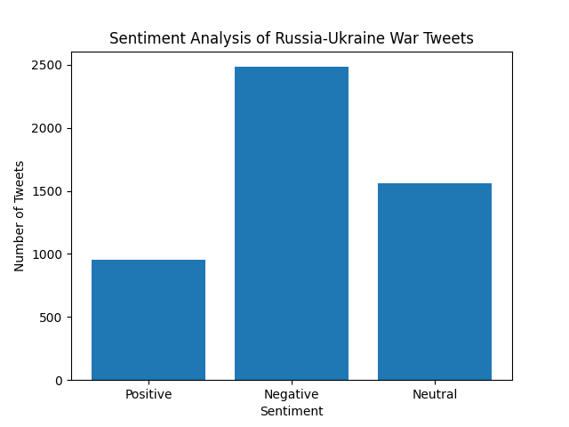
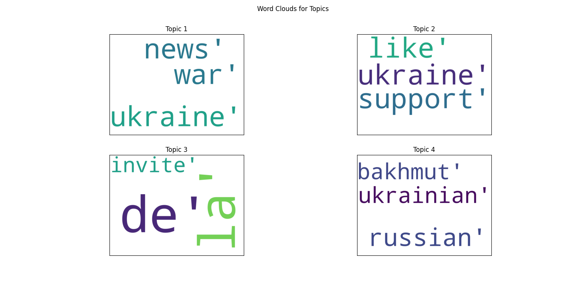

# Sentiment Analysis and Topic Modeling of Russia-Ukraine War-related Tweets

## SENTIMENT ANALYSIS


## TOPIC MODELING


## Steps to run this program:
1. Clone this repository
1. Change the .env.local file to .env and provide the BEARER_TOKEN of twitter API
1. Install the packages mentioned in requirements.py
```bash
pip install -r requirements.txt
```
4. If you do not have BEARER_TOKEN then uncomment line no. 20 - 23 and comment line no. 19 in main.py
1. run the main.py file
```bash
python main.py
```
